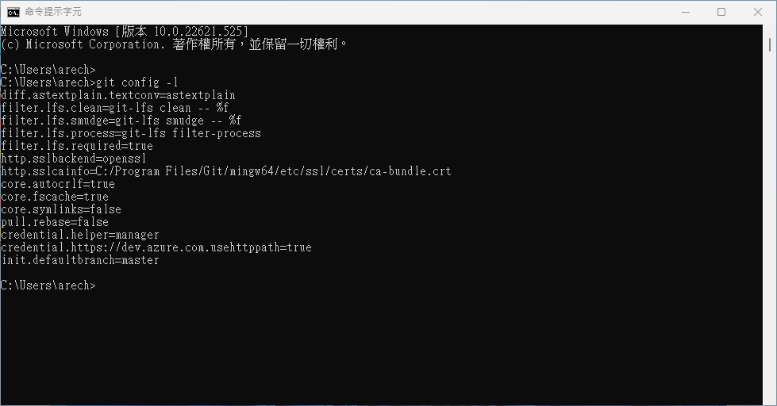
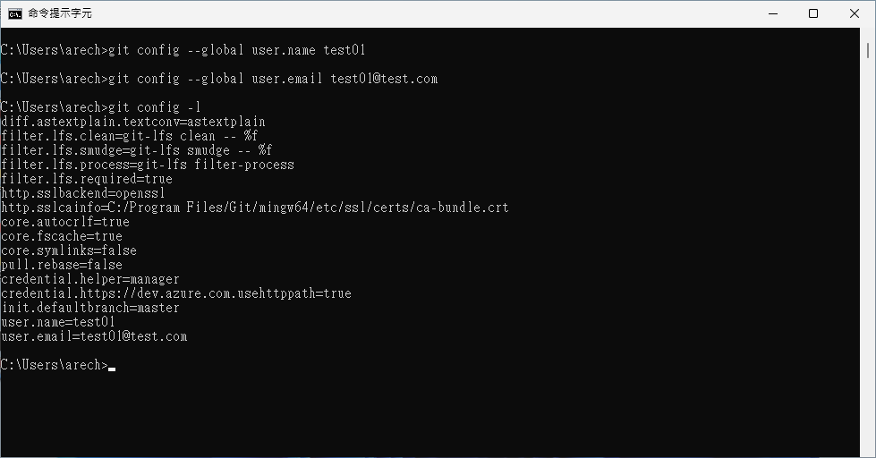

# I.最初的設定

1. 需要先在當前的電腦安裝[git](https://git-scm.com/)版控軟體，否則無法進行版控的操作。
2. 確認目標版控平台是否有自己的帳戶(GitHub、Gitea)，目前公司預計採用的是<font color=lighblue>Gitea</font>
3. 在最初未設定任何資料的狀態下先在終端機上使用以下指令並產生當下個人 Git 的資訊

```
    git config --global -l
```

<br/>

4. 之後在自己所使用的機台上建立基本資料<font color=orange>(需討論相關格式)</font>：

-   <font color=lightGreen>user.name</font> {員工代號}<br>
    例如：user.name test
-   <font color=lightGreen>user.email</font> {員工信箱}<br>
    例如：user.email test01@test.com

    運行的代碼與結果如下

```
	git config --global user.name test
    git config --global user.email test01@test.com
```

<br> 

到此基本個人設定就算完成，如果個人有需要基於相同機台不同資訊則使用上述的指令修改資訊後即可改變。

[返回目錄](../README.md)
