# I.基礎的設定

1. 需要先在當前的電腦安裝[git](https://git-scm.com/)版控軟體，否則無法進行版控的操作，以下是安裝git的畫面與當下建議：
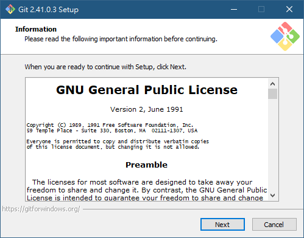
**版權說名：有需要可以看一下**<br><br>
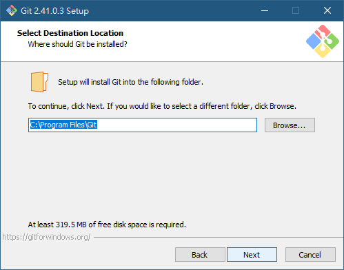
**預設儲存位置：基本上沒特別需求不用改變**<br><br>
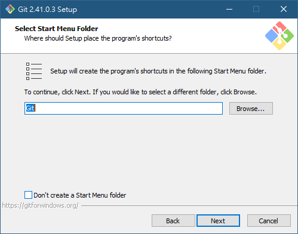
**在開始是否要顯示git的資料夾：Git預設有幾個程式可以使用，除了一個GUI以外另外的都是終端機**<br><br>
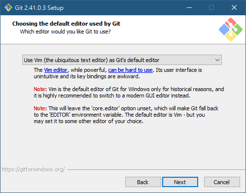
**選擇基本編輯文件的工具：Git的設定檔、commit的文檔編輯工具預設是VIM，但個人是推薦用VSCode相較於終端機編輯器會稍微圖形化一點**<br><br>
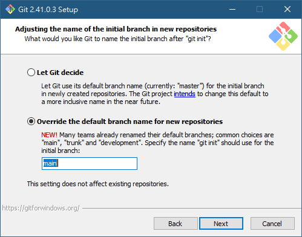
**最初主幹的命名：看團隊或個人的習慣而定，個人是偏好main，但若以master或其他也可以**<br><br>
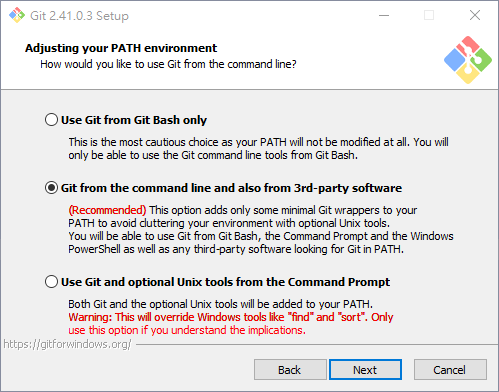
**操作的Git的方式：第一個或第三個都是純終端機，第二個是終端機與第三方混合，**<br><br>
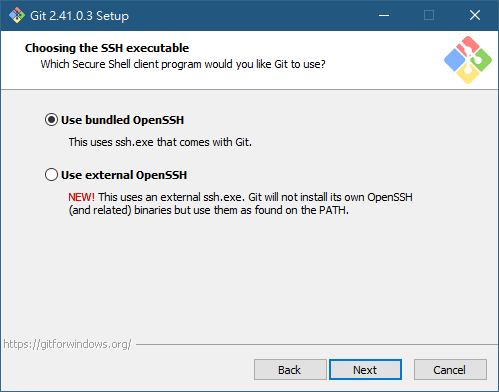
**是否要用自帶的SSH工具還是要用第三方的工具：基本上都會選擇自帶的**<br><br>
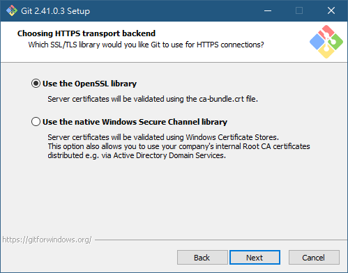
**同上是否要用自帶的HTTP驗證工具還是windows的安全存證：**<br><br>
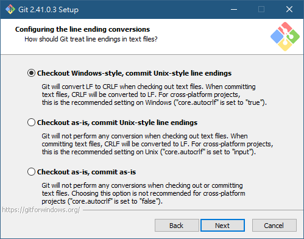
**行尾符號轉換：跨平台開發有關的部分**<br><br>
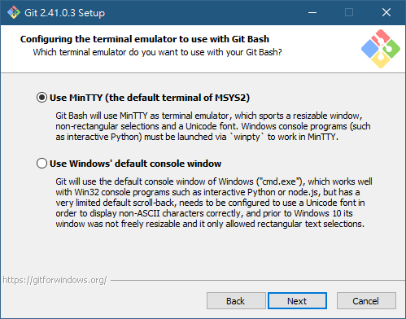
**Git Bash終端機模擬器的配置**<br><br>
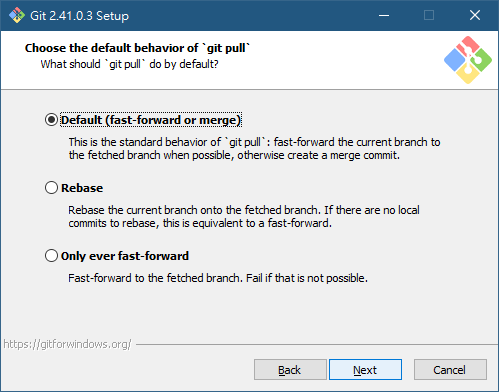
**git pull的默認動作：預設是第一個**<br><br>
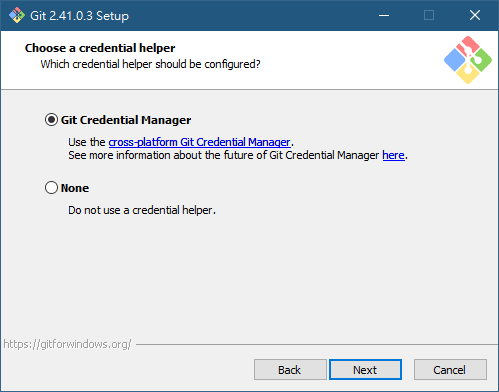
**git憑證管理:預設第一個**<br><br>
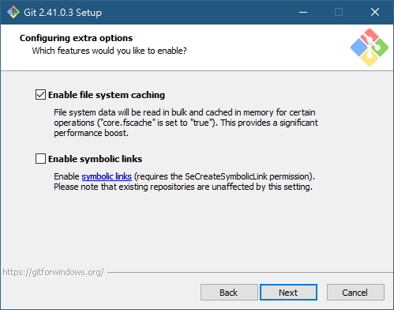
**額外功能**<br><br>
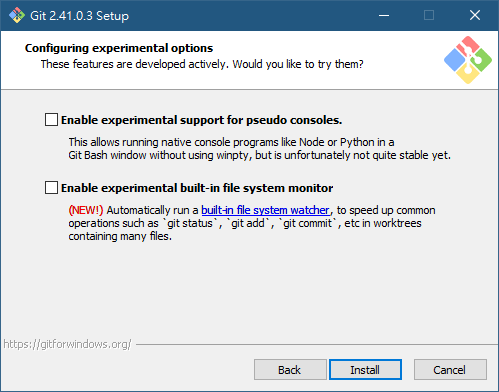
**額外功能**<br><br>
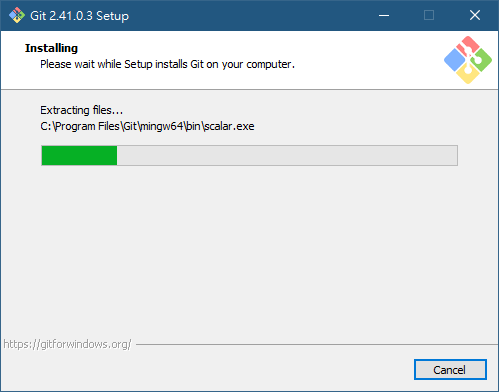
**安裝中**<br><br>
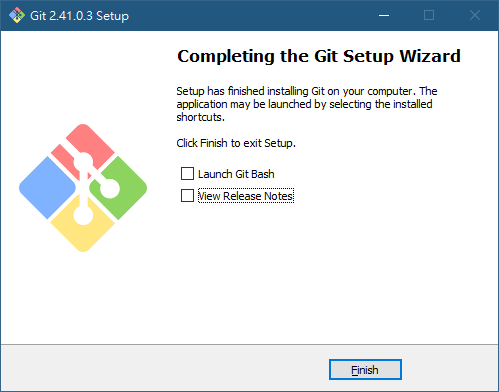
**到這邊就算安裝完畢了**<br><br>
2. 確認目標版控平台是否有自己的帳戶(GitHub、Gitea)，目前公司預計採用的是<font color=lighblue>Gitea</font>
3. 在最初未設定任何資料的狀態下先在終端機上使用以下指令並產生當下個人 Git 的資訊

```
    git config --global -l
```

<br/>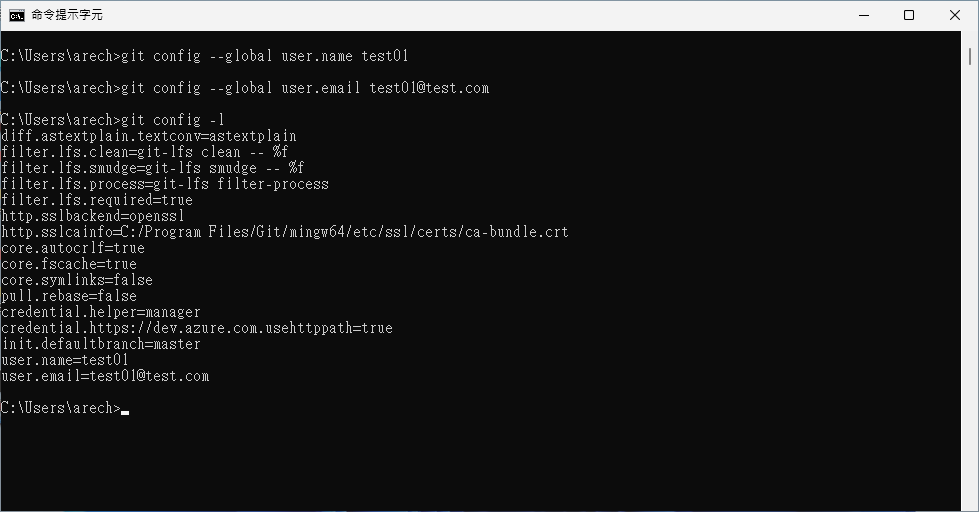

4. 之後在自己所使用的機台上建立基本資料<font color=orange>(需討論相關格式)</font>：

-   <font color=lightGreen>user.name</font> {員工代號}<br>
    例如：user.name test
-   <font color=lightGreen>user.email</font> {員工信箱}<br>
    例如：user.email test01@test.com

    運行的代碼與結果如下

```
	git config --global user.name test
    git config --global user.email test01@test.com
```

<br> 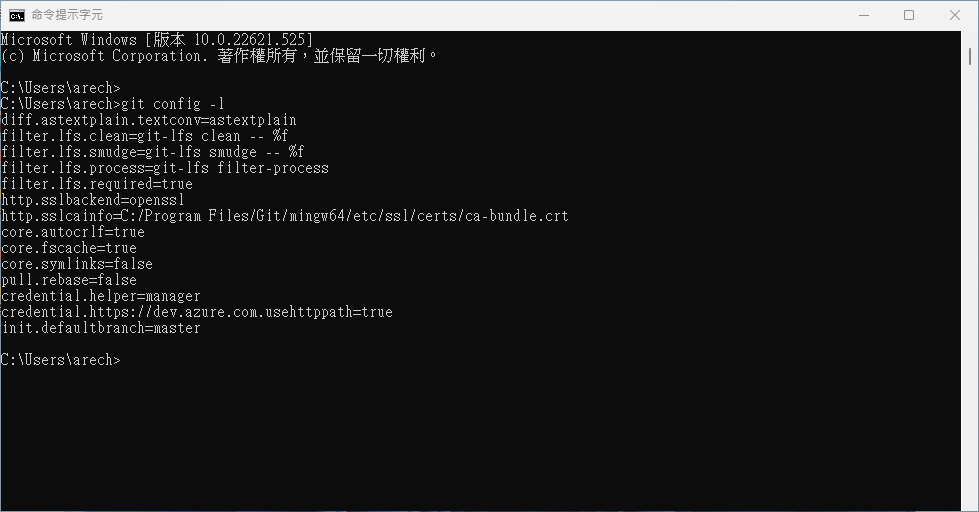

到此基本設定就算完成，如果個人有需要基於相同機台不同資訊則使用上述的指令修改資訊後即可改變。

[返回目錄](../README.md)
