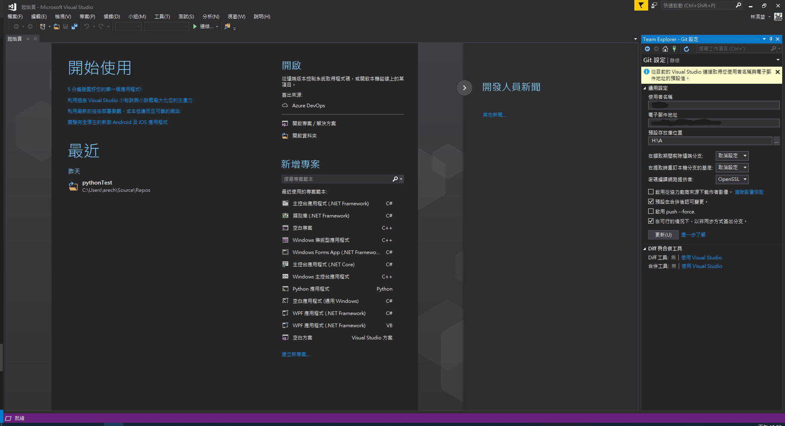
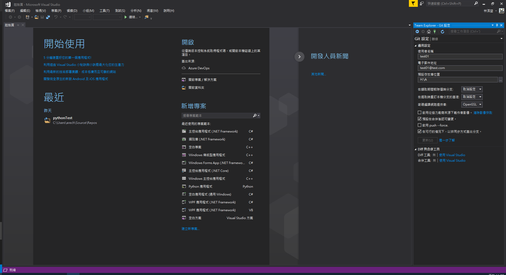

# I.基礎的設定

## 安裝Git
 需要先在當前的電腦安裝[git](https://git-scm.com/)版控軟體，否則無法進行版控的操作，以下是安裝git的畫面與當下建議：
 
**版權說名：有需要可以看一下**  
 
**預設儲存位置：基本上沒特別需求不用改變**  
 
**在開始是否要顯示git的資料夾：Git預設有幾個程式可以使用，除了一個GUI以外另外的都是終端機**  
 
**選擇基本編輯文件的工具：Git的設定檔、commit的文檔編輯工具預設是VIM，但個人是推薦用VSCode相較於終端機編輯器會稍微圖形化一點**  
 
**最初主幹的命名：看團隊或個人的習慣而定，個人是偏好main，但若以master或其他也可以**  
 
**操作的Git的方式：第一個或第三個都是純終端機，第二個是終端機與第三方混合，**  
 
**是否要用自帶的SSH工具還是要用第三方的工具：基本上都會選擇自帶的**  
 
**同上是否要用自帶的HTTP驗證工具還是windows的安全存證：**  
 
**行尾符號轉換：跨平台開發有關的部分**  
 
**Git Bash終端機模擬器的配置**  
 
**git pull的默認動作：預設是第一個**  
 
**git憑證管理：** 這邊會牽扯到本地透過HTTP推送到Gitea的帳號問題，如果常態性的推送到不同Gitea的帳號會建議選擇下面的選項，並且透過終端機的方式推送否則透過Visual Studio 2017內建的Git外掛會出現無法推送到目標帳號下遠端庫的問題，但只針對一個單一帳號的話上面的選項即可。  
 
**額外功能**  
 
**額外功能**  
 
**安裝中**  
 
**到這邊就算安裝完畢了**  

## 本地Git的使用者資訊
在安裝好Git後需要先設定使用者資訊，設定順序如下：  
 
**點選"檢視"  **

**點選"Team Explorer"的選項**  
 
**點選旁邊的小箭頭  **
 
**點選"設定"**  
 
**點選"全域設定"**  
 
**這邊在"使用者名稱"與電子郵件地址設定想要設定的資訊**  
 
**填完之後按下"更新"就設定完使用者資訊了**
 

[返回目錄](../README.md)
