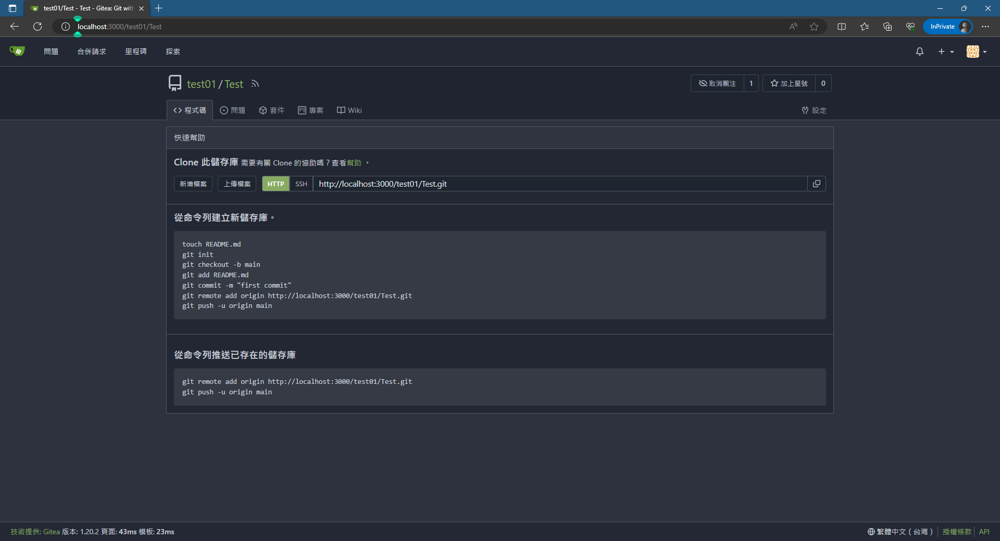

# II.建立空白的遠端庫
建立空白遠端庫瑾能透過網頁，以下說明建立的方式。

 
**首先點選右邊的"+"**  
 
**這邊說明個選項的功能，但目前是建立空的庫所以不會使用：**
-   擁有者：類似此專案的 PM，擁有這個庫的所有權。
-   儲存庫名稱：庫的名稱，如說明所示，過長的名稱會使庫的主題過於複雜，若需要更多的說明可在下方的描述做陳述。
-   瀏覽權限：可以選擇將目前的庫設為非公開，若有些部分是做測試或是，只能針對特定客戶，則建議勾選。
-   描述：當庫的名稱所無法詳述的部分適合放在這邊作陳述補充，類似研究文獻中的摘要。
-   .gitignore：有些跟專案無關的設定或是僅本機運行的單元測試，不適合、沒必要或是不允許放在庫上的忽略清單，可以是單一個檔案或是一個資料夾。
-   授權條款：非核心技術，或是讓社群、大眾或是合作單位使用的限制條款。
-   讀我檔案：相較於名稱與描述，更加詳細的描述使用過程、使用方向、庫的限制、釋出的版本、已分享的平台等等，可以放上任何與此庫有關的敘述。
-   預設分支：庫類似樹狀的發展方向，所有分支最終的主線，名稱可以自訂為任何名稱
  
**設定好名稱後結果如下**
