# II.建立存放庫

建立遠端存放庫有許多種方式這邊以透過網頁的連線與透過Visual Studio 2017的外掛插件建立，以下分別做示範。 

## 透過網頁建立
在最初的個人庫上做推送到遠端庫之前必須先建立庫的資訊
  

  

如畫面所示：

-   擁有者：類似此專案的 PM，擁有這個庫的所有權。
-   儲存庫名稱：庫的名稱，如說明所示，過長的名稱會使庫的主題過於複雜，若需要更多的說明可在下方的描述做陳述。
-   瀏覽權限：可以選擇將目前的庫設為非公開，若有些部分是做測試或是，只能針對特定客戶，則建議勾選。
-   描述：當庫的名稱所無法詳述的部分適合放在這邊作陳述補充，類似研究文獻中的摘要。
-   .gitignore：有些跟專案無關的設定或是僅本機運行的單元測試，不適合、沒必要或是不允許放在庫上的忽略清單，可以是單一個檔案或是一個資料夾。

*   授權條款：非核心技術，或是讓社群、大眾或是合作單位使用的限制條款。
*   讀我檔案：相較於名稱與描述，更加詳細的描述使用過程、使用方向、庫的限制、釋出的版本、已分享的平台等等，可以放上任何與此庫有關的敘述。
*   預設分支：庫類似樹狀的發展方向，所有分支最終的主線，名稱可以自訂為任何名稱。

當上述選項都設定好後產生的結果會類似下圖

 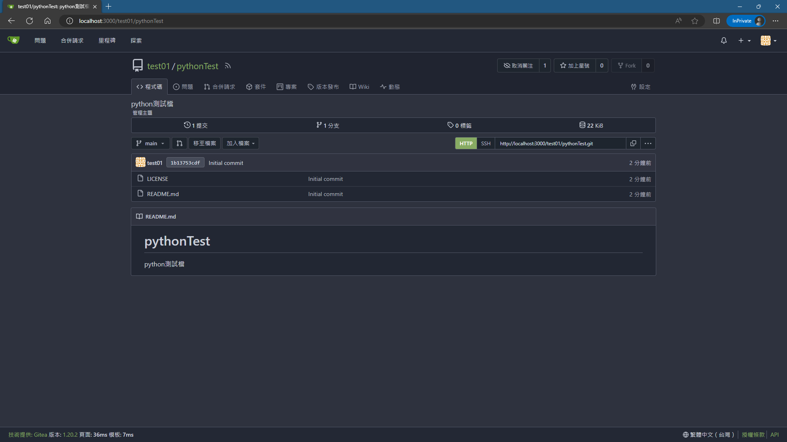

## 透過Visual Studio 2017的外掛插件
### 首先要先在Visual Studio 2017安裝外掛
  
**點選"工具"**  
 
**點選"擴充功能和更新"，美化或是對於增加IDE輔助的功能基本上在這邊都找得到**  
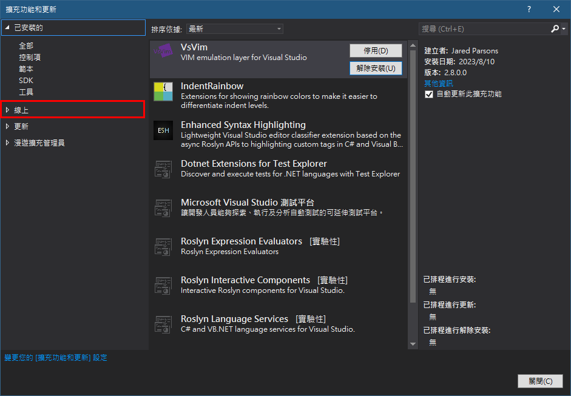 
**在這個畫面先切換分頁到"線上"**  
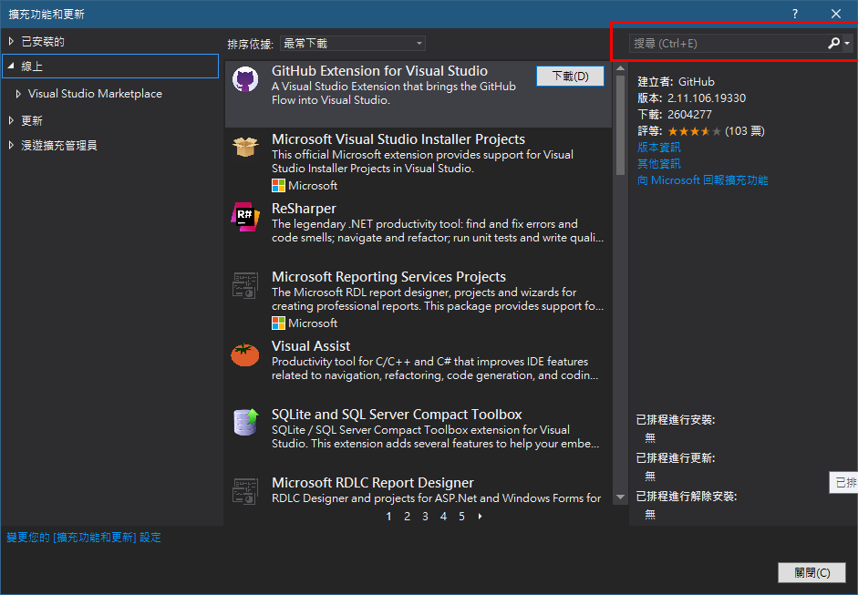 
**在搜尋欄上打上鑰搜尋的"gitea"**  
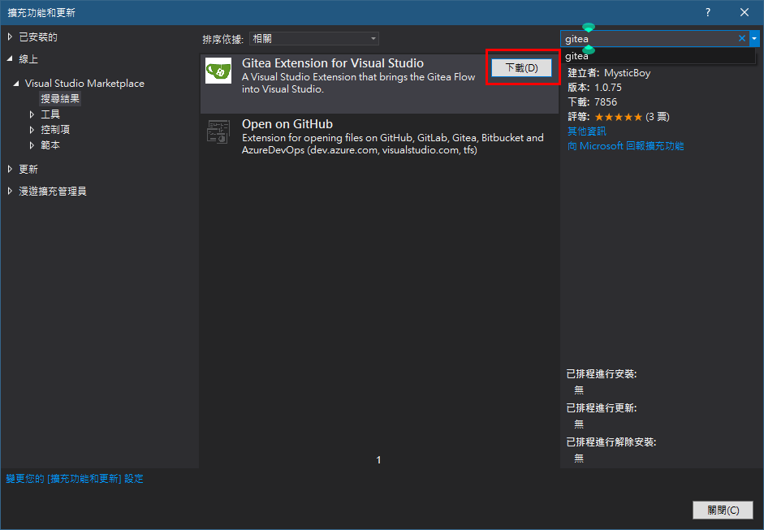 
**點選下載按鈕**  
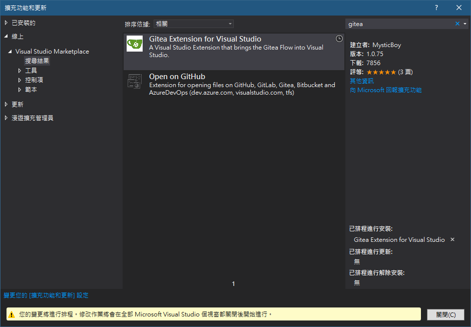 
**到這邊就是已經排定擴充功能安裝的完成，要關閉Visual Studio才會開始安裝。**  
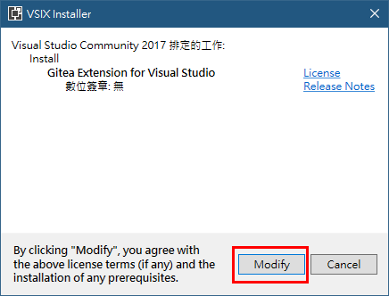 
**由於先前關閉Visual Studio之前有排定安裝擴充功能，因此這邊要按下"Modigy"(調整)才會開始安裝。**  
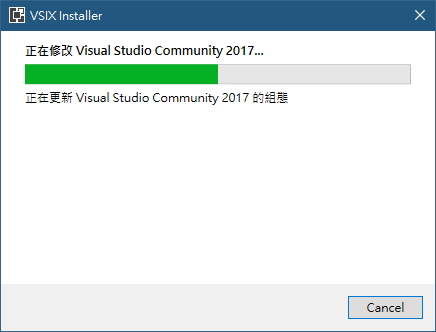 
**安裝中**  
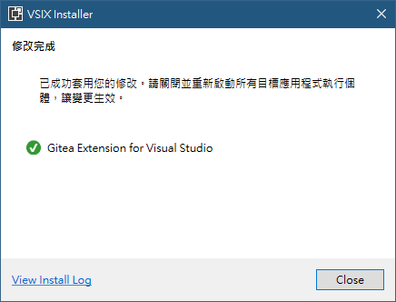 
**到這邊就是安裝完畢，進入Visual Studio就可以使用這個功能了。**  
 
**該插件的功能是在Team Explorer裡面，因此要點選"檢視"**  
 
**再點選"Team Explorer"**
 

### 這時候畫面右邊的"Team Explorer - 連線"會出現"Gitea"的功能，到這裡就是插件安裝完成，可以按下"Connect"開始建立連線。
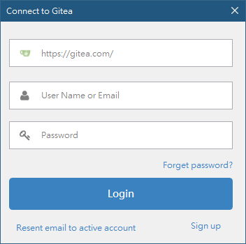 
**在這個畫面要先填上登入的Gitea網址、當時註冊的帳號與密碼**  
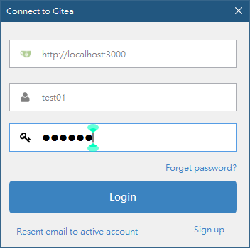 
**填完之後就可以將Visual Studio與Gitea做連線**  
 
**這時候就如同網頁上一樣可以建立遠端庫了，點選"Create"  
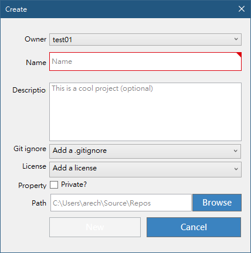 
**填上庫的名稱、說明、是否要增加".gitignore"、憑證、是否是私有的以及本地庫的儲存位置**  
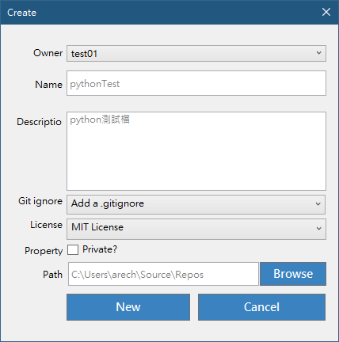 
**填好之後按下"New"可以建立好庫了**  
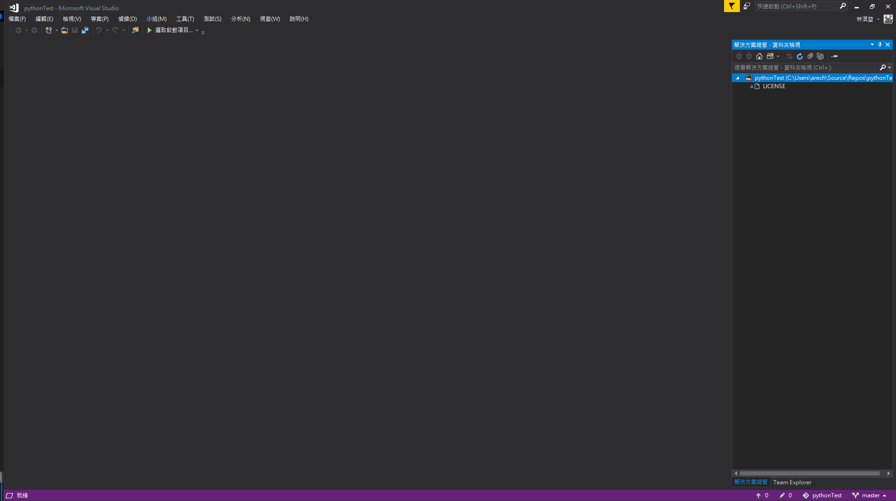 

[返回目錄](../README.md)
