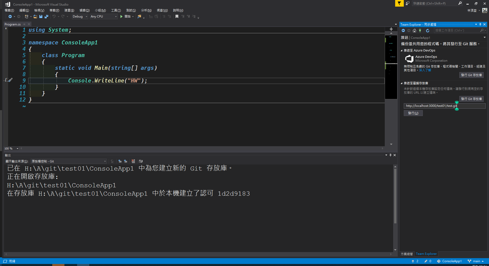

# III.推送與標籤

## <font color=lightgreen>本捷主要以 HTTP 為主，下一節會使用 SSH 並說明兩者差異</font>

1. 在任何要將本地資料夾所有的內容上傳到遠端數據庫之前，必須先使用以下代碼做初始化

```
    git init
```

<br>

**若不確定推送的個人資訊可以使用以下指令做確認**

```
    git config --global -l
```

2. 初始化之後要先建立本地與遠端庫的連結，這邊先以 HTTP 的連結方式做推送說明

```
    git remote add {遠端庫的代號} {遠端庫位置的HTTP格式}
```

<br>
結果可能類似下圖

<br>

-   由於數據庫有可能牽扯到所有權問題，因此需要確認是否有要增加例外權限<font color=orange>(待確認)</font>

```
    git config --global -- add safe.directory {目標資料夾路徑}
```

結果如下


3. 當建立庫連結成功後原本在檔案總管的顏色會顯示變化，<font color=lightgreen>綠色</font>為新增的項目，<font color=yellow>黃色</font>為變更的項目，沒有變色表示項目與遠端庫相同，由於是新的專案對遠端庫來說就是新的項目，因此範例的結果是<font color=lightgreen>綠色</font>。由於在本地已經有變動，但對遠端來說還是未改變的狀態，因此要將已改變的項目新增到改變的推送隊列當中，指令與變化如下：

```
    git add .
```


<font color=pink>**當然也可以謹上傳部分檔案，不過不建議這麼做**</font>

若要確認當前添加到推送隊列的狀態可以使用以下指令，變化如附：

```
    git status
```

<br>

<br>

4. 當增加到推送隊列後需要附上推送的證明(類似商品打包後的貼上物流單據)才可以推送，指令與變化如下：

```
	git commit -m "{訊息}"
```

<br>

**至此推送的前置作業已經完畢，後續可以在附加上標籤(tag)以增加存放到庫之後，後續的搜尋便利性**

<br>

5. 推送前可以選擇將目前的項目推送到不同的分支與附上不同的標籤，代碼分別如下，但結果先以 TAG 為主，分支在最初的推送尚不是需要的部分：

```
    git tag {名稱}
```

<br>

**若不加上{名稱}則列出先前有用過的 TAG**

6. 最後要將項目推送到遠端庫才算是推送完成

```
	git push -u {儲存庫的名稱} {對應的分支} --tags
```

<br>

**後面的--tags 是可選的，用意在於更新 TAG，若不需要更新 TAG 可以忽略**

[返回目錄](../README.md)
