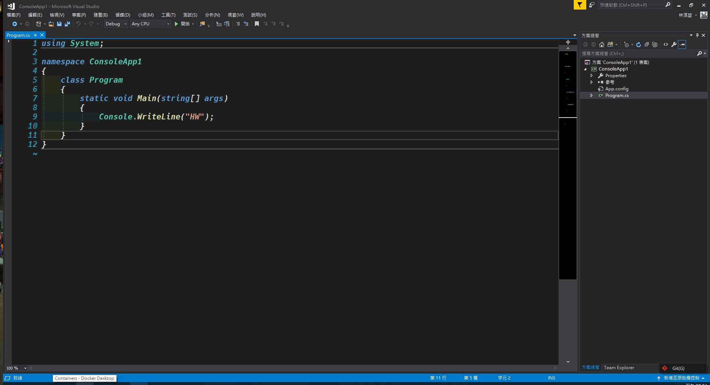
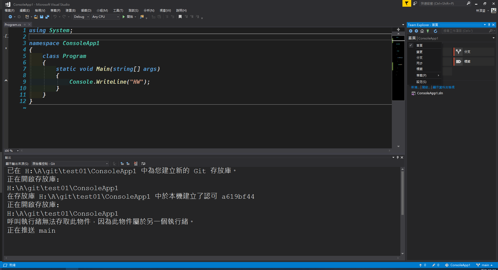
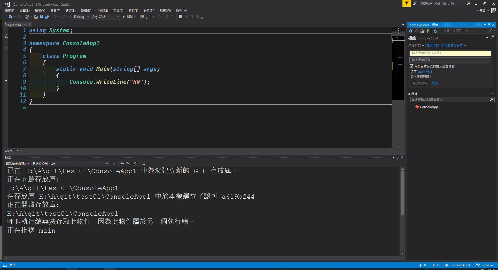

# III.推送與標籤
在建立完遠端庫、修改專案、預提交給PM審查或保存當前專案進度都要推送過後才能確保專案統一管理在遠端庫，下面分別說明推送與標籤的部分。
## 推送
**假設現在所編寫的專案已經全部都儲存完成了，再來就要進行推送，其流程如下：** 
  
**按右下角的"新增至原始檔控制"的選項**  

**點選"Git"**  

**這時候右邊的Team Explorer - 同步處理會出現推送分頁，由於還沒有添加遠端庫的位置因此要在這邊添加，點選推送至遠端存放庫子標籤的"發行Git存放庫"**  
 
**這邊要提供遠端庫的URL**   
 
**Visual Studio 2017預設是走HTTP，因此必須使用HTTP的選項。確認選項是選HTTP後按右邊的複製URL按鈕**  

**貼上之後按下"發行"就可以綁定現在的專案與遠端庫的連結**   

**由於是透過Visual Studio 2017創建的庫，因此也會一併進行commit與push，下面兩個狀態提示左邊是"待推送的數量"右邊是"已變更的檔案、資料夾總數"**  

## 標籤
**若推送的專案沒有設置標籤的話新的檔案會一直堆疊上去，當數量一多的時候會很難找到先前所推送的穩定或共同核可的版本，這時候就是要付加上標籤好讓後續追蹤時可以快速地從某個版本開始動作，下面來講解如何添加標籤：** 
 
**點選Team Explorer的首頁分頁**  
 
**點選標籤分頁**  
 
**點選"新增標籤"**  
 
- **標籤名稱：** 一般都會用版本號作為標籤名稱。
- **標籤訊息：** 可以填上這個標籤主要是什麼狀態，可能是已發行、內部共識或不穩定版當中的較穩定版等等，可以幫助團隊或自己更容易了解這個標籤的附註說明。  
 
**當上述確定之後可以按下建立標籤。**   
 
**這邊要注意的是標籤雖然已經建立但是這是在前面的推送過後才建立的，因此還需要再推送一次，按下推送全部，這樣才會把標籤一併放置遠端庫。**  

**到此當前進度才算告一個段落，之後可以去網頁上查看剛剛推送的是否有成功**  

[返回目錄](../README.md)
