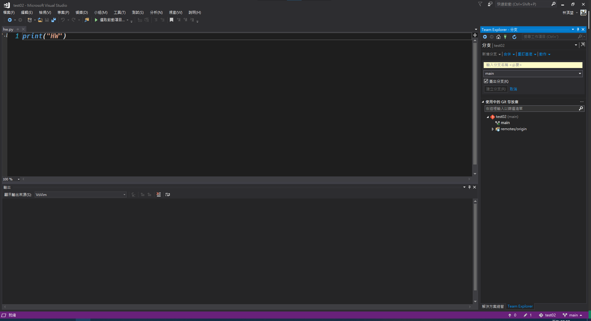

# IV.克隆與分支
在瀏覽線上的原始碼代管服務平台時，對某個庫有興趣，而且瀏覽過該庫所提供的代碼覺得某些部份可以修改或優化時，可以在平台上對該庫進行分叉(fork)的動作，這個動作類似開新的分支，但是這個分支並不屬於原本的庫，而是類似切割的概念，接下來會分別說明克隆與分支的操作。
## 克隆
若再瀏覽平台的列表時看到該專案有興趣比如下圖的例子： 
 
**在探索的其間找到有興趣的專案**  
 
**對這個庫的專案有興趣或是想要基於這個庫的架構開發新的不同軟體可以按上方的"Fork"按鈕**  
 
**由於原本的專案是屬於開源的方式因此權限已經被綁定不能設為私有。描述可以選擇要寫下什麼方向，修改或是切割成新的專案等等。確認好之後就可以按下"Fork儲存庫"**  
 
**這時候眼尖的會發現庫的名稱下會有一小行註明這個專案是fork自其他人的庫，到這時候網頁上的"Fork"工作就完成了，接下來本地要對這個庫進行克隆下載的動作，同樣確認傳輸類行為HTTP並且複製URL** 
P.S.如果不Fork也是可以，但基本要確認這個庫的所有權是否為自己的，如果不是自己的克隆下來是肯定不能推送上去，更何況同公司不同部門之間的干預影響程度會有多大。  
 
**對本地來說遠端庫上的專案是不存在的，因此克隆的概念類似創建新的專案，點選"複製"**  
 
**這邊要填上剛剛在網頁上複製的URL，並且設定好專案在本地儲存的位置**  
 
**接著按下"複製"**  
 
**到這時候就算是克隆完成了**  

## 分支
**接續上面的克隆專案，假設現在本身的專案添加的新的檔案，但不確定新增的檔案是否核可，因此可以將現在已經到一個段落的專案放在其他分支上，當核可之後可以將這個分支合併到主幹上，從而使專案在兩個狀態之間不會互相影響，下面來說明如何放在新的分支上：**  
 
**現在新增了一個檔案但不確定這個檔案是否核可，因此可以點選右下角的"main"**  
 
**點選>"新增分支"**  
 
**這邊要輸入要分支的名稱**  
 
**簽出分支如果不勾選的話是會維持在原本的分支，設定好之後可以按下建立分支**  
 
**可以看到剛剛右下角的"main"已經變成剛剛新增的分支了。**  
 
**可以順便檢視解決方案總管是否有剛剛所新增的資料，確認分支設定好之後就是開始要進行後續的提交，點選變更分頁開始進行提交的動作**  
 
**在變更分頁可以看到分支已經切換為剛剛所新增的分支，接下來在要提交附加訊息裡面填上要提交的內容**  
 
**當確認訊息完成之後可以按下全部認可(還有其他兩個選項，可以再自行了解)**  
 
**在剛剛點選變更頁面的選項旁邊推送頁面會變成"1個等待推送"，點選它就會切換頁面到"同步"頁面**  
 
**按下"推送"的選項，就會開始執行推送這個分支到遠端儲存庫**  
 
**到這邊就是已經"推送"完畢，如果需要確認是否有推送成功可以去網頁上面查看**  
 
**在這邊可以切換分支查看分支的狀態與確認專案的發展**

[回上一層](../README.md)