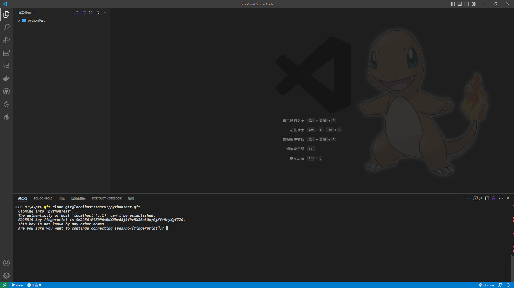
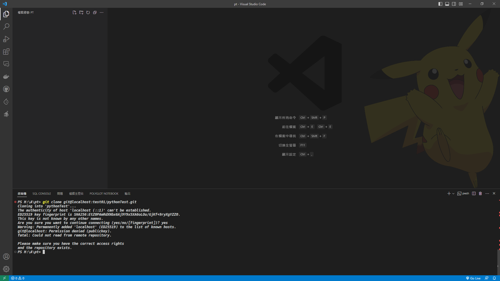
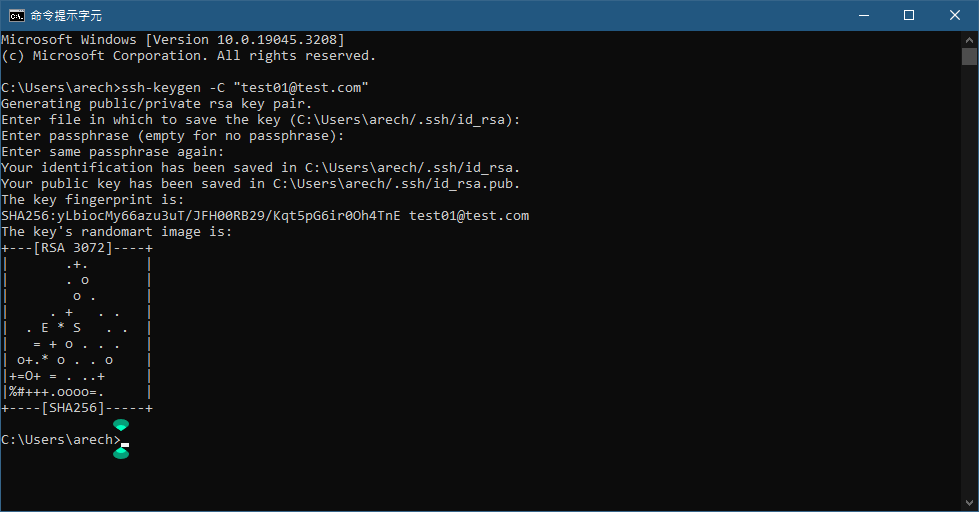
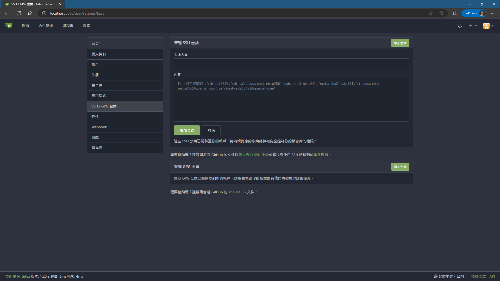
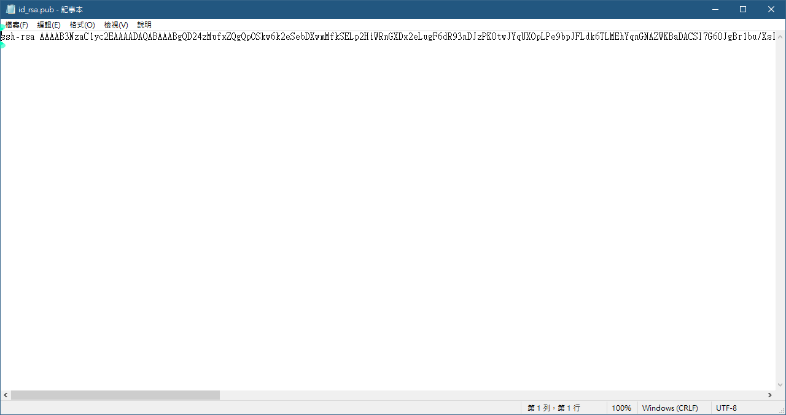
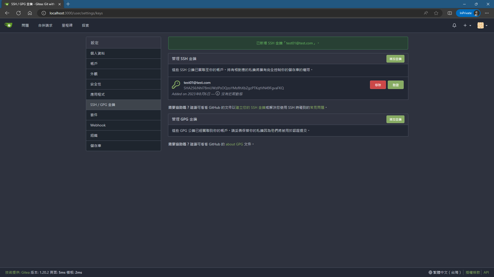
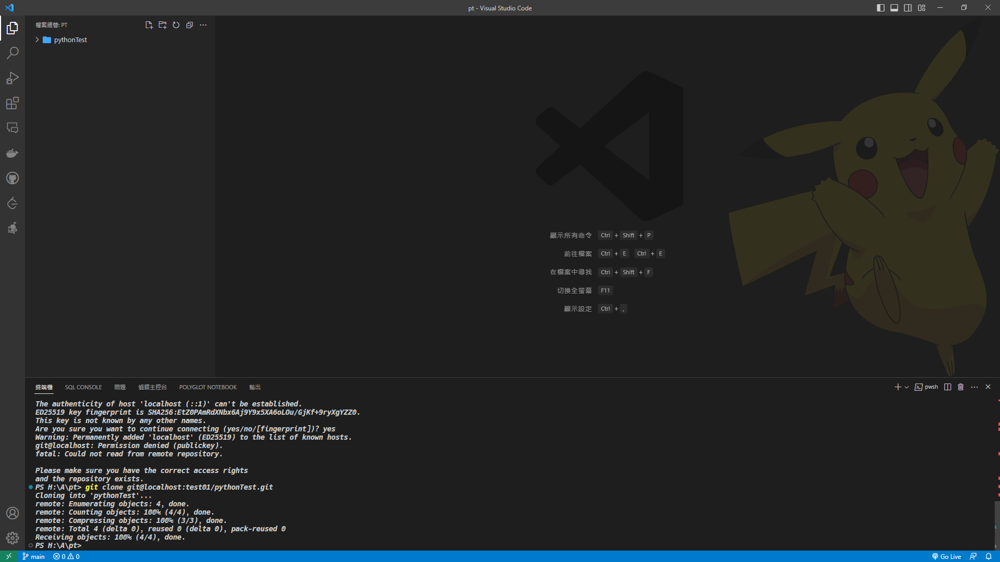

# IV.克隆與 SSH

## <font color=lightgreen>本節主要為 SSH 的部分，相對於 HTTP 的傳輸速度更快也更安全但也較複雜，因此如果不是長期所使用的機台建議使用 HTTP，但如果是開發或是常用的可以使用 SSH，兩者主要都是使用(Key Chain)的方式做傳輸。</font>

1. 首先到鑰操作的遠端庫下找到遠端庫位置的 SSH 格式路徑，並複製：
   

2. 之後到本地終端機進行 clone(範例所使用的是 VSCode 的開放式文字編輯器，方便做 clone 後的比較與參考)到本地才能夠進行編輯，由於是第一次所接觸的庫，在本地電腦沒有任何的與遠端庫相關的連線紀錄因此必須要使用 clone 的方式，指令與結果如下：

```
    git clone {遠端庫位置的SSH格式}
```



**上述的詢問提示是基於本地沒有與遠端庫進行過任何連線的紀錄，因此是否確定要與遠端庫進行連線的詢問，此時輸入<font color=lighblue>yes</font>後會出現如下圖的結果**



**由於遠端庫並未有本地的公鑰因此請求連線後的傳輸會被拒絕，意思是單方面的接受連線，但未進行身分的確認而無法獲取庫下面的任何文件，因此必須在本地建立<font color=orange>公鑰</font>(Public-Key)與<font color=orange>私鑰</font>(Private-Key)後，並將<font color=orange>公鑰</font>與遠端庫的帳戶做綁定，這樣遠端庫才能認定本地發出請求 clone 的機台是屬於某個帳戶的請求，才會允許執行 clone 的動作。**

<br>

2. 要建立 SSH 的公私鑰鑰在終端機當中使用以下指令：

```
    ssh-keygen
```

**若是不帶任何參數公私鑰預設會是使用<font color=purple>{當前的使用者帳號}</font>@<font color=purple>{機台名稱}</font>作為本地的標籤名稱，在新增到<font color=lighblue>Gitea</font>的時候自動會把這個標籤當作配對的公鑰名稱<font color=orange>(當然也是可以再次更名為自己喜歡或好記的)</font>，<font color=yellow>這邊先以標籤"test01@test.com"為範例</font>。**<br>



-   **Enter file in which to save the key (C:\Users\arech/.ssh/id_rsa)** ：設定公私鑰儲存的位置，若不設定按下 Enter 鍵後，預設是在<font color=lightgreen>當前使用者帳戶下的.ssh 資料夾下</font>。
-   **Enter passphrase (empty for no passphrase)** 與 **Enter same passphrase again** ：前者為公私鑰是否還要額外加上密碼，若安全性需要可以加上，若不需要則留空白按下 Enter 即可，後者為再次驗證密碼。

**當 SSH 建立完成之後就可以將公鑰放置於遠端庫的管理資料庫中。**

<br>
3. 與遠端庫的帳戶進行綁定<font color=orange>公鑰</font>：
    




**到這一步後先去<font color=lightgreen>.ssh</font>資料夾下複製公鑰**


**開啟後會出現類似以下的畫面**



**將全部內容複製並貼到剛剛新增的金鑰中的內容框格內**


**完成的結果如下**



再次執行 clone 指令後會出現以下畫面



**由於先前沒有編輯過，因此遠端庫上所有的檔案、文件、資料夾等等都會存在被 clone 下來在一個資料夾內，<font color=red>該資料夾名稱就是遠端上庫的名稱</font>，若之後鑰編輯或是修改都是在<font color=pink>目標資料夾</font>下進行，若在現在的位置進行會<font color=pink>另外建立一個新的庫</font>在遠端庫上。**

[返回目錄](../README.md)
