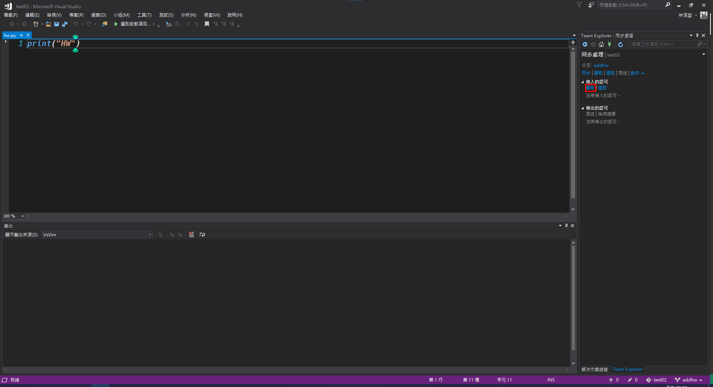
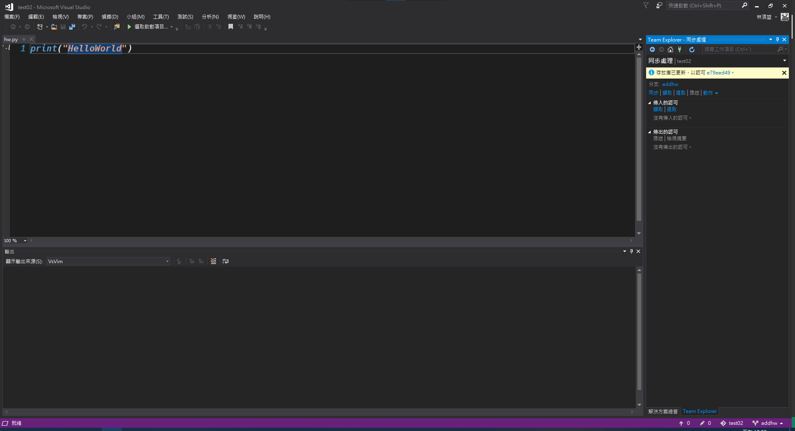
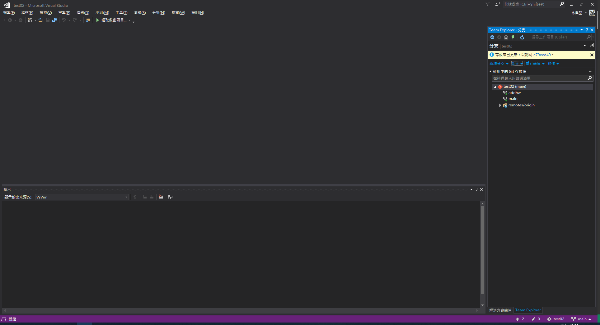
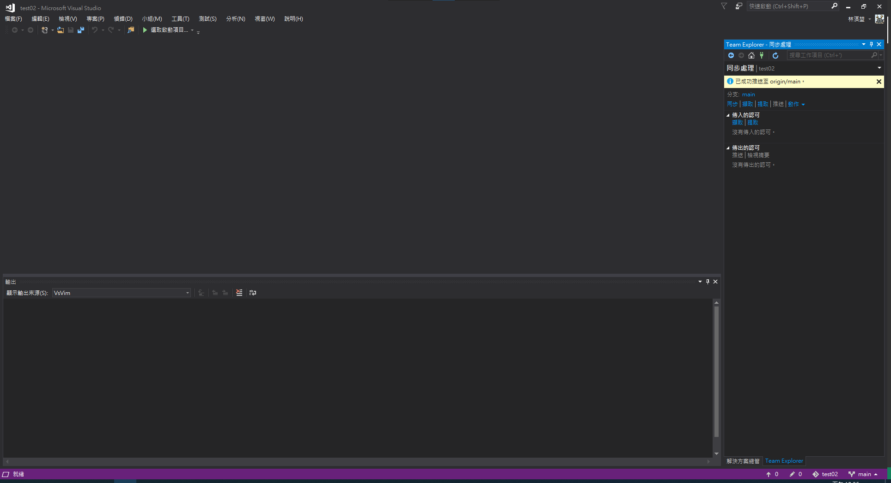

# 提取與合併
**在與他人共同處理一個專案或是在之前某個時間點在遠端庫增加了新的或變更檔案檔案時，遠端庫上的進度雖然有更新，但是本地端卻未同步改變，這時候需要用到<font color=lightgreen>擷取</font>(pull)的動作，將遠端庫的進度與現在的進度做同步；同步處理之後，管理者也同意採用原先分支的專案，也需要做<font color=lightgreen>合併</font>(merge)分支的動作，以下分別說明這兩著的實際操作與產生的結果。**
## 提取
<br>
**<font color=pink>有人通知或是自己發現專案有修改過，需要進行與本地端的同步</font>**<br><br>
<br>
**開啟原先所編寫的專案，並且將<font color=lighblue>Team Explorer</font>切換到<font color=orange>"同步"</font>分頁，並點選<font color=lightgreen>"擷取"</font>獲取遠端庫變更的<font color=lightblue >提交</font><br><br>
<br>
**從遠端庫獲取了有變更的<font color=lightgreen>提交</font>因此可以使用<font color=lightgreen>提取</font>(pull)來把遠端<font color=lightgreen>提交</font>的部分<font color=lightgreen>提取</font>下來**<br><br>
<br>
**<font color=lightgreen>提取</font>成功時會顯示<font color=lightyellow>"存放庫已經更新"</font>訊息這時候可切換到方案總管確認或是原先有打開的檔案查看變更的內容，如範例：**
```python
print("HW")
```
上面原本程式碼的字樣已經改變成下面的字樣
```python
print("HelloWorld")
```
<br>**到這邊就是<font color=lighblue>提取</font>完成，接下來要進行<font color=lighblue>合併</font>的部分**<br><br>

## 合併
<br><br>
**合併之前要先切換到<font color=green>"要合併過去"</font>的目標分支，點選右下角的<font color=lighblue>"當前分支"</font>**<br><br>
<br>
**點選<font color=lighblue>"目標分支"</font>**<br><br>
<br>
**可以看見的是<font color=lighblue>"當前分支"</font>已經切換成<font color=lighblue>"目標分支"</font>了，這時候再將當前分頁切換到<font color=lighblue>"分支"</font>分頁**<br><br>
<br>
**點選<font color=lighblue>"合併"</font><br><br>
<br>
**選擇<font color=lighblue>"從分支合併"</font>選擇原來的分支**<br><br>
<br>
**確認好來源與目標分支後按下<font color=lighblue>"合併"</font>就會將兩個分支做合併動作**<br><br>
<br>
**合併玩之後會顯示<font color=lightyellow>"存放庫已經更新"</font>，的訊息表示兩個分支已經合併完成，這時後再<font color=lightgreen>"提交"</font>並<font color=lightgreen>"推送"</font>就完成分支合併的部分了**<br><br>
<br>
**當顯示<font color=lightyellow>"已成功推送至{目標庫的分支後}"</font>，就表示完成。

[回上一層](../README.md)